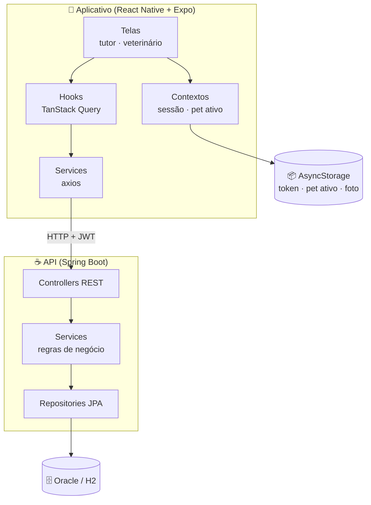
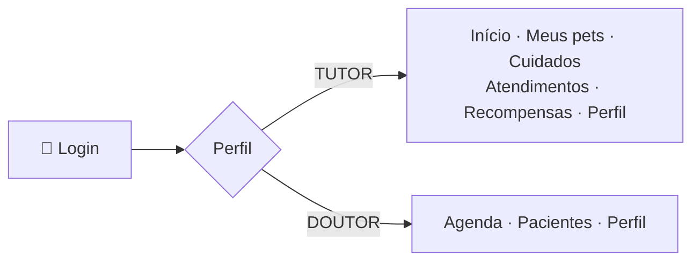
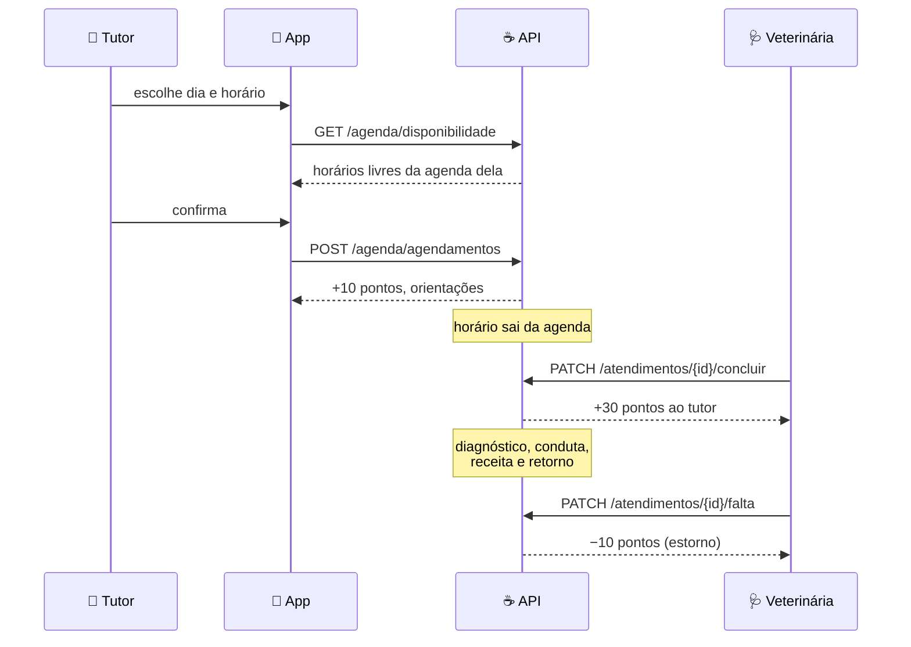

# 🐾 Animed — Aplicativo Mobile

Aplicativo do **Animed**, solução do nosso squad para o Challenge da empresa parceira **Clyvo VET** — FIAP 2026, turma 2TDS.

O Animed ataca um problema que a própria Clyvo VET descreveu: a jornada de saúde do pet é **episódica e reativa**. O tutor só procura a clínica quando algo já aconteceu. O aplicativo transforma cada ato de cuidado em pontos, os pontos em nível, e o nível em **desconto real** em pet shops parceiros — dando ao tutor um motivo concreto para cuidar antes de o problema aparecer.

---

## 👥 Squad Animed

| Integrante | RM |
|------------|-----|
| **Kaiky de Oliveira Silva** (líder) | 566067 |
| Erick Bernardes Bradaschia | 565733 |
| Gabriel Santos Claudino | 564054 |
| Jonathan Moreira Gomes | 565060 |
| Lucas Fortes de Lima | 559523 |

**Repositório da API:** https://github.com/kaiky06301/animed-api

---

## 🎬 Vídeo de demonstração

> _(link a inserir)_

---

## 🏛️ Arquitetura

O aplicativo não guarda regra de negócio: pontuação, níveis, disponibilidade de agenda e validações vivem na API Java. Isso é proposital — as mesmas regras precisam valer para o app do tutor e para a área do veterinário, e uma regra duplicada é uma regra que vai divergir.



### Por que cada camada existe

| Camada | Papel | Onde fica |
|--------|-------|-----------|
| **Telas** | Só apresentação e interação | `src/screens/` |
| **Hooks** | Cache, revalidação e estado de carregamento | `src/hooks/` |
| **Services** | Fala HTTP com a API, um arquivo por recurso | `src/services/` |
| **Contextos** | Sessão do usuário e pet selecionado | `src/state/` |
| **Componentes** | Peças reaproveitadas entre telas | `src/components/` |

---

## 👤 Os dois perfis

O mesmo aplicativo atende tutor e veterinário, com navegação inteiramente distinta — decidida no login, pela `role` que vem no token.



Essa separação existe porque há atos que **só o veterinário pode praticar**. Registrar vacina, por exemplo: a Resolução CFMV nº 1.321/2020 define a vacinação como ato privativo do médico-veterinário. O tutor vê a carteira de vacinas; quem a preenche é a clínica. O mesmo vale para prescrever medicamento e concluir atendimento — e a API recusa com **403** se o perfil errado tentar.

---

## 🔄 Fluxo principal: do agendamento ao ponto creditado



O ponto do agendamento **não é definitivo**: se o tutor não comparecer, a veterinária registra a falta e o crédito volta atrás. Pontos premiam cuidado, não a intenção de cuidar.

---

## 🎮 Gamificação

### O que rende pontos

| Ação | Pontos | Quem registra |
|------|-------:|---------------|
| Cadastrar o primeiro pet | 50 | tutor |
| Perfil completo do pet | 50 | tutor |
| Foto do primeiro pet | 15 | tutor |
| Dose de medicamento | 15 | tutor |
| Atualização de peso | 5 | tutor |
| Agendar atendimento | 10 | tutor |
| Compra em parceiro | variável | tutor |
| Vacina aplicada | 25 | **veterinário** |
| Consulta realizada | 20 | **veterinário** |
| Check-up concluído | 30 | **veterinário** |

### Níveis e desconto

| Nível | Faixa | Desconto | Moedas |
|-------|-------|---------:|--------|
| 🥉 Básico | 0 – 299 pts | 0% | bloqueadas |
| 🥈 Cuidador | 300 – 1.199 pts | 10% | bloqueadas |
| 🥇 Tutor Premium | 1.200+ pts | 15% | **liberadas** |

Além dos pontos, cada crédito gera **moedas** — saldo gastável que abate até metade do valor de uma compra, a dez centavos por moeda. As moedas só são liberadas no Tutor Premium: é o que dá horizonte longo à jornada, em vez de o benefício se esgotar no primeiro nível.

### Como a economia se defende

Uma gamificação ingênua vira fonte infinita de pontos. As travas que existem hoje:

| Brecha | Trava |
|--------|-------|
| Cadastrar vários pets para repetir o bônus | Só o **primeiro pet** pontua; limite de 5 pets |
| Trocar a foto sem parar | Uma vez, e só no primeiro pet |
| Digitar peso repetidamente | Um crédito a cada **7 dias**, por pet |
| Clicar em "dei o remédio" em série | Dose só pontua respeitando o **intervalo da receita** |
| Marcar horário só para pontuar | **Falta** estorna; **cancelamento** custa 30 pontos |
| Gastar moedas zerando a compra | Abatimento limitado a **metade** do valor |

O registro sempre acontece — o histórico clínico precisa refletir a realidade. O que as regras limitam é o **crédito**.

---

## 📱 Telas

### Tutor

| Tela | O que faz |
|------|-----------|
| **Início** | Pontos, nível, progresso, situação das vacinas e próximo atendimento |
| **Meus pets** | Lista, troca o pet ativo, cadastro e edição |
| **Cuidados** | Medicamentos, pesagem e marcação de atendimento |
| **Medicamentos** | Receitas em curso, registro de dose, atraso e fim do tratamento |
| **Atendimentos** | Próximos e histórico, com detalhe e cancelamento |
| **Vacinas** | Carteira por ano, reforço vencido e agendamento da aplicação |
| **Recompensas** | Vitrine dos parceiros, desconto do nível e compra com moedas |
| **Histórico** | Extrato de pontuação, com estornos |
| **Perfil** | Dados, foto do pet, plano, troca de senha |
| **Planos** | Gratuito, Intermediário e Premium |

### Veterinário

| Tela | O que faz |
|------|-----------|
| **Agenda** | Atendimentos do dia, concluir, registrar falta e marcar retorno |
| **Pacientes** | Carteira da clínica, com busca |
| **Ficha do paciente** | Vacinas aplicadas, prescrição e tratamentos em curso |
| **Perfil** | Resumo da carteira e troca de senha |

### Públicas

**Login** e **Criar conta**, com revelar senha.

---

## 🧰 Stack

| Recurso | Versão | Para quê |
|---------|--------|----------|
| React Native | 0.85.3 | base do aplicativo |
| Expo | SDK 56 | build e execução |
| TypeScript | 6 | tipagem do domínio |
| React Navigation | 7 | abas e pilha, por perfil |
| **TanStack Query** | 5 | cache e sincronização com a API |
| **axios** | 1.20 | cliente HTTP com token |
| AsyncStorage | 2.2 | sessão, pet ativo e foto |
| expo-image-picker | 56 | foto do pet |

---

## 🔌 Integração com a API

Todas as chamadas passam por `src/api/cliente.ts`, que injeta o token JWT e traduz o erro da API em mensagem legível.

| Recurso | Endpoints usados |
|---------|------------------|
| Autenticação | `POST /api/auth/login` · `POST /api/auth/registrar` · `PATCH /api/auth/senha` |
| Pets | `GET/POST/PUT /api/pets` · `POST /api/pets/{id}/foto` |
| Tutor | `GET /api/tutores/{id}` |
| Vacinas | `GET /api/vacinas/por-pet/{id}` · `POST /api/vacinas` |
| Agenda | `GET /api/agenda/disponibilidade` · `/mes` · `/dia` · `POST /api/agenda/agendamentos` |
| Atendimento | `PATCH /api/agenda/atendimentos/{id}/concluir` · `/cancelar` · `/falta` |
| Medicamentos | `GET /api/medicamentos/por-pet/{id}` · `POST /api/medicamentos` · `POST /{id}/doses` |
| Cuidados | `POST /api/cuidados` |
| Pontuação | `GET /api/historico-pontuacao/por-tutor/{id}` |
| Compras | `POST /api/transacoes` |

---

## ▶️ Como executar

O aplicativo precisa da API no ar.

### 1. Suba a API

```bash
git clone https://github.com/kaiky06301/animed-api
cd animed-api
./mvnw spring-boot:run -Dspring-boot.run.profiles=h2
./scripts/dados-demo.sh          # cria o cenário de demonstração
```

### 2. Aponte o aplicativo para ela

O endereço é resolvido sozinho em cada ambiente: `10.0.2.2` no emulador Android, `localhost` no iOS e no navegador. Em **celular físico**, informe o IP da máquina na mesma rede:

```bash
EXPO_PUBLIC_API_URL=http://192.168.0.10:8080 npx expo start
```

### 3. Rode o aplicativo

```bash
npm install
npx expo start        # leia o QR Code com o Expo Go
npm run android       # emulador Android
npm run ios           # simulador iOS
```

### Contas de demonstração

| Perfil | E-mail | Senha |
|--------|--------|-------|
| Tutor | `tutor@animed.com.br` | `animed123` |
| Veterinária | `doutor@animed.com.br` | `animed123` |

---

## 🗂️ Estrutura

```
animed-app/
├── App.tsx                     # providers e navegação raiz
├── assets/
│   └── produtos/               # fotos da vitrine (Unsplash)
├── src/
│   ├── api/cliente.ts          # axios, token e tradução de erro
│   ├── components/             # 17 componentes reaproveitados
│   ├── data/                   # catálogo dos parceiros
│   ├── hooks/                  # 12 hooks de dados (TanStack Query)
│   ├── navigation/             # navegação por perfil
│   ├── screens/                # telas do tutor
│   │   └── doutor/             # telas do veterinário
│   ├── services/               # 11 clientes de recurso da API
│   ├── state/                  # sessão e pet ativo
│   ├── theme/                  # paleta e espaçamentos
│   └── utils/                  # níveis e formatação
└── package.json
```

---

## 💰 Modelo de negócio

**B2C** — três planos: Gratuito, Intermediário (R$ 14,90) e Premium (R$ 29,90).

**B2B** — pet shop paga taxa base baixa para entrar na plataforma e comissão sobre as vendas originadas no aplicativo. A conta fecha porque o desconto sai da margem do parceiro, que em troca ganha recorrência: o `TransacaoParceiroService` calcula desconto, abatimento em moedas, valor final e comissão em cada compra.

---

## 🌐 Posicionamento

> **Animed** — solução para o Challenge da empresa parceira **Clyvo VET**.

A Clyvo VET pediu para transformar a jornada do pet de **episódica** em **contínua, preventiva e integrada**. O Animed entrega essa continuidade ligando as três pontas: o tutor registra o dia a dia, a clínica registra o ato clínico, e a recompensa em parceiros fecha o ciclo — cada um enxergando o mesmo histórico do animal.
